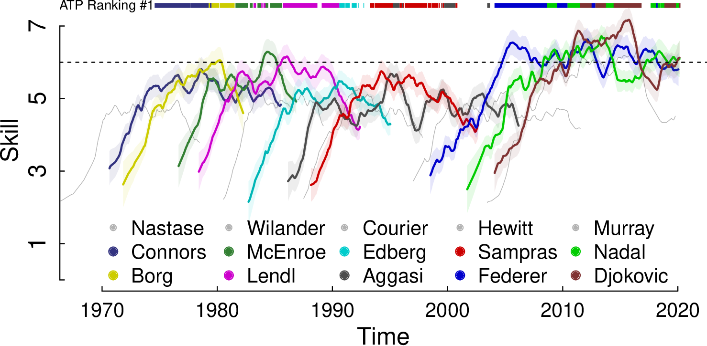
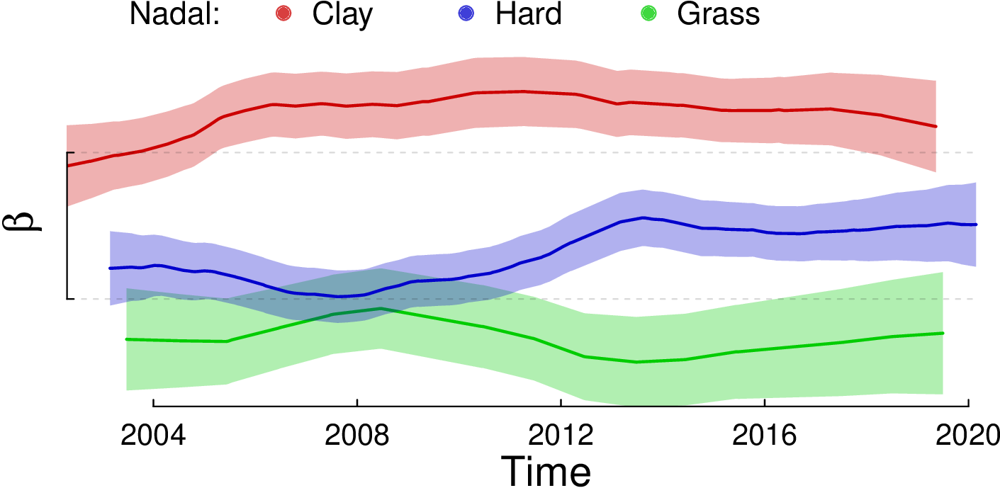
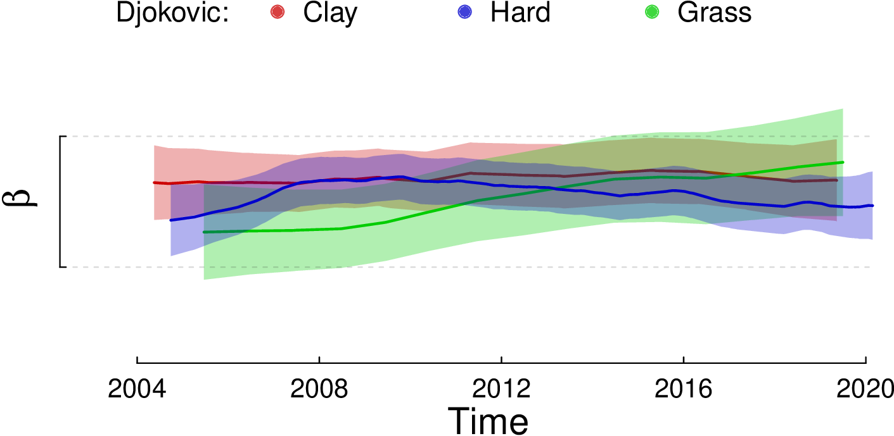

# TrueSkillThroughTime.R

**The state-of-the-art skill model**: _Individual learning curves with reliable initial estimates and guaranteed comparability between distant estimates._

## Install

To install the package from CRAN

    install.packages("TrueSkillThroughTime")

Then just

	library(TrueSkillThroughTime)

## Summary

Most estimators implemented by the video game industry cannot obtain reliable initial estimates nor guarantee comparability between distant estimates. TrueSkill Through Time solves all these problems by modeling the entire history of activities using a single Bayesian network allowing the information to propagate correctly throughout the system. This algorithm requires only a few iterations to converge, allowing millions of observations to be analyzed using any low-end computer.

A full technical documentation is discribed at:

0.  English. [Last version](https://github.com/glandfried/TrueSkillThroughTime/releases/download/doc/landfried-learning.pdf)
0.  Español. [Última versión](https://github.com/glandfried/TrueSkillThroughTime/releases/download/doc/landfried-aprendizaje.pdf)

Here is the last pdf version of the manual:  [TrueSkillThroughTime.R](https://github.com/glandfried/TrueSkillThroughTime.R/releases/download/manual/TrueSkillThroughTime.R.pdf)

## Ilustrations

In the following code we define the variables that we will use later, assigning the default values of the packages.

`mu = 0.0; sigma = 6.0; beta = 1.0; gamma = 0.03; p_draw = 0.0`

### Players 

With these default values we create four identical players.

`a1 = Player(Gaussian(mu, sigma), beta, gamma); a2 = Player(); a3 = Player(); a4 = Player()
`

The `Gaussian` class is used to model the standard operations of Gaussian distributions including multiplication, summation, division, and substraction.

### Games

In the next step we create a game with two teams of two players.

```
team_a = c(a1, a2)
team_b = c(a3, a4)
teams = list(team_a, team_b)
g = Game(teams)
```

where the result of the game is implicitly defined by the order of the teams in the list: the teams appearing first in the list (lower index) beat those appearing later (higher index).

During the initialization, the `Game` class computes the prior prediction of the observed result and the approximate likelihood of each player.

```
lhs = g@likelihoods
ev = g@evidence
ev = round(ev, 3)
print(ev)
> 0.5
```

In this case, the evidence is 0.5 indicating that both teams had the same probability of winning given the prior estimates.

Posteriors can be found by manually multiplying the likelihoods and priors, or we can call the method `posteriors()` of class `Game` to compute them.

```
pos = posteriors(g)
print(pos[[1]][[1]])
> Gaussian(mu=2.361, sigma=5.516)
print(lhs[[1]][[1]] * a1@prior)
> Gaussian(mu=2.361, sigma=5.516)
```

Due to the winning result, the estimate of the first player of the first now has a larger mean and a smaller uncertainty.

We now analyze a more complex event.
The players are organized in three teams of different size: two teams with only one player, and the other with two players.
The result has a single winning team and a tie between the other two losing teams.

```
ta = c(a1)
tb = c(a2, a3)
tc = c(a4)
teams = list(ta, tb, tc)
result = c(1, 0, 0)
g = Game(teams, result, p_draw=0.25)
```
the team with the highest score is the winner and the teams with the same score are tied.
The evidence and the posteriors can be queried in the same way as before.

### Sequence of Events

The class `History` is used to compute the posteriors and evidence of a sequence of events.
In the first example, we instantiate the class with three players `"a", "b", "c"` and three games in which all agents win one game and lose the other.

```
c1 = list(c("a"),c("b"))
c2 = list(c("b"),c("c"))
c3 = list(c("c"),c("a"))
composition = list(c1,c2,c3)
h = History(composition, gamma=0.0)
```

where the variables `c1`, `c2`, and `c3` model the composition of each game using the names of the agents (i.e. their identifiers), the variable `composition` is a list containing the three events, and the value of the parameter `gamma = 0.0` specifies that skills does not change over time.

After initialization, the class `History` immediately instantiates a new player for each name and activates the computation of the TrueSkill estimates, using the posteriors of each event as a prior for the next one.

```
lc = h$learning_curves()
lc_print(lc[["a"]])
> [(1, Gaussian(mu=3.339, sigma=4.985)), (3, Gaussian(mu=-2.688, sigma=3.779))]
lc_print(lc[["b"]])
> [(1, Gaussian(mu=-3.339, sigma=4.985)), (2, Gaussian(mu=0.059, sigma=4.218))]
```

The learning curves of players `"a"` and `"b"` contain one tuple per game played (not including the initial prior): each tuple has the time of the estimate as the first component, and the estimate itself as the second one.

Although in this example no player is stronger than the others, the TrueSkill's estimates present strong variations between players.
TrueSkill Through Time solves this problem, allowing the information to propagate throughout the system, by calling the method `convergence()`.

```
h$convergence()
lc = h$learning_curves()
lc_print(lc[["a"]])
> [(1, Gaussian(mu=0, sigma=2.395)), (3, Gaussian(mu=0, sigma=2.395))]
lc_print(lc[["b"]])
> [(1, Gaussian(mu=0, sigma=2.395)), (3, Gaussian(mu=0, sigma=2.395))]
```

TrueSkill Through Time not only returns correct estimates (same for all players), they also have less uncertainty.

### Skill evolution

This example will exhibit that TrueSkill Through Time can correctly follows the skill evolution of a new player that joins a large community of already known players.
In the following code, we generate the target player's learning curve and 1000 random opponents.

```
N = 1000
skill <- function(experience, middle, maximum, slope){
    return(maximum/(1+exp(slope*(-experience+middle)))) }
target = skill(seq(N), 500, 2, 0.0075)
opponents = rnorm(N,target,0.5)
```
The list `target` has the agent's skills at each moment: the values start at zero and grow smoothly until the target player's skill reaches two.
The list `opponents` includes the randomly generated opponents' skills following a Gaussian distribution centered on each of the target's skills and a standard deviation of 0.5.
```
composition = list(); results = list(); times = c(); priors = hash()
for(i in seq(N)){composition[[i]] = list(c("a"), c(toString(i)))}
for(i in seq(N)){results[[i]]=if(rnorm(1,target[i])>rnorm(1,opponents[i])){c(1,0)}else{c(0,1)}}
for(i in seq(N)){times = c(times,i)}
for(i in seq(N)){priors[[toString(i)]] = Player(Gaussian(opponents[i],0.2))}
    
h = History(composition, results, times, priors, gamma=0.015)
h$convergence(); lc_a = h$learning_curves()$a; mu = c()
for(tp in lc_a){mu = c(mu,tp[[2]]@mu)}
```
In this code we define four variables to instantiate the class `History`: the `composition` contains 1000 games between the target player and different opponents; the `results` are obtained randomly, sampling the performance of the players; the `time` is a list of integer ranging from 0 to 999 representing the time of each game; and `priors` is a dictionary used to customize player attributes (we assign low uncertainty to the opponents' priors pretending that we know their skills beforehand).
The Figure shows the evolution of the true (solid line) and estimated (dotted line) learning curves of the target player.


The estimated learning curves remain close to the actual skill during the whole evolution.

### Association of Tennis Professionals 2019

In this last example, we analyze a dataset of the ATP 2019, containing 14701 games played by 1306 unique players.

```
invisible(atp2019) # activate the database
```

Each game has an identifier (i.e. `match_id`) and its tournament's round number (i.e. `round_number`), where 0 represents the final game, 1 the semi-final, and so on.
The file also contains players' identifiers and names.
For example, column `w2_id` is the second player's identifier of the winning team, and `l1_name` is the first player's name of the losing team. 
Finally, we have the tournament's name (`tour_name`), its identifier (`tour_id`), the tournament's starting date (`time_start`), and the type of surface (`ground`).

```
get_composition = function(x){
    res = list()
    if (x["double"]=="t"){
        res[[1]] = c(x["w1_name"],x["w2_name"])
        res[[2]] = c(x["l1_name"],x["l2_name"])
    }else{
        res[[1]] = c(x["w1_name"])
        res[[2]] = c(x["l1_name"])
    }
    return(res)
}
composition =  apply(atp2019, 1, get_composition ) 
days = as.numeric(as.Date(atp2019[,"time_start"], format = "%Y-%m-%d"))

h = History(composition = composition, times = days, sigma = 1.6, gamma = 0.036)
h$convergence(epsilon=0.01, iterations=10)
```

Here we create the variables `days` and `composition`, and instantiate the class `History`.
We define the event times as the days elapsed from a reference date to the tournament start date, assuming that the skill is the same within each tournament.
When generating the list `composition` we discriminate whether the games are doubles or singles using the column `double`. 
The results are determined by the composition's order, placing the winning team first.
When initializing the class `History` we set the values of `sigma` and `gamma` based on an optimization procedure previously performed.
Finally, we use the `convergence()` method to obtain TrueSkill Through Time estimates explicitly selecting the convergence criterion: when the change between iterations is less than $0.01$ or when ten iterations are performed.

The following figure presents the estimated learning curves of some famous players in ATP's history using the complete history of the Association of Tennis Professionals (ATP) registered matches ([history.csv.zip](https://github.com/glandfried/tennis_atp/releases/download/atp/history.csv.zip)).
The learning curves share a similar pattern: they begin with rapid growth, reach an unstable plateau, and end with a slow decline (we hidden the last portion of the players who have long final stages for visualization purposes).



The top bar indicates which player was at the top of the ATP's ranking (the bar has no color when player number 1 is not included among the 10 players identified with colors).
ATP's ranking points are updated every Monday according to the prestige of the tournament and the stage reached. 
There is a relative coincidence between the skill estimates and who is at any given moment at the top of the ATP rankings.
The following Table shows the historical ranking of players in the top position of the ATP's ranking according to the number of weeks occupying the first position.

|No| Name | Weeks at top|
|:-:|:-:|:-:|
|    1       |   Novak Djokovic      |   320|
|    2       |   Roger Federer       |	310|
|    3       |	Pete Sampras        |   286|
|    4       |   Ivan Lendl          |   270|
|    5       |   Jimmy Connors       |   268|
|    6       |   Rafael Nadal        |   209|
|    7       |   John McEnroe        |   170|
|    8       |   Bj\"orn Borg        |   109|
|    9       |   Andre Agassi        |   101|
|    10      |   Lleyton Hewitt      |   80 |
|    11 	    |   Stefan Edberg       | 	72|
|    12 	    |   Jim Courier         | 	58|
|    13 	    |   Gustavo Kuerten     | 	43|
|    14 	    |   Andy Murray         | 	41|
|    15 	    |   Ilie N\u{a}stase    | 	40|
|    16 	    |   Mats Wilander       | 	20 |

However, TrueSkill Through Time allows comparing the relative ability of players over time: the 10th player in the historical ATP's ranking, Hewitt, is a product of the window of opportunity that was opened in the year 2000; and the 4th most skilled player, Murray, is ranked 14th just above Nastase.
Individual learning curves enable recognizing special periods of crisis and prolonged stability of the professional players, and even the effects of emotional slumps such as those suffered by Aggasi and Djokovic.
It is worthwhile to note that the skill of tennis players did not increase abruptly over the years: contrary to what might have been expected, the players of the 1980s were more skilled than those of the 1990s, and reached a skill similar to what Federer, Nadal and Djokovic had in 2020, even though the latter reached higher values for a longer time.

### Multidimensional skills

In the previous example, we summarize the players' skills in a single dimension.
TrueSkill Through Time allows estimating multi-dimensional skills. 
It is known that the ability of certain tennis players varies significantly depending on the surface.
To quantify this phenomenon, we propose modeling each player as a team composed of a generic player, who is included in all the games, and another player representing their ability on a particular surface.
For example, Nadal will be represented as a two-player team: `Nadal_generic` and `Nadal_clay` when playing on this kind of surface, and `Nadal_generic` and `Nadal_grass` when participating in the Wimbledon tournament.
In the following figures we show the skill difference that Nadal and Djokovic have in each of the three types of ground.



Nadal has a notorious skill difference when playing on different surfaces. 
The Nadal's skill difference between clay and grass grounds is greater than one $\beta$, which means at least 76\% difference in probability of winning compared to itself.
On the contrary, Djokovic has very similar skills in the three types.



In the case of Nadal (id `"n409"`), it seems important to model the skill's multi-dimensionality, while in Djokovic's case (id `"d643"`) it seems reasonable to summarize it in a single dimension.
To assess whether the complexity added by modeling multi-dimensionality is appropriate in general terms, we can compare the joint prior prediction of the models, calling the method `log_evidence()` of the class `History`.

### Plotting your own learning curves

Here is an example to plot the learning curves of the class `History`.
First solve your own example.
Here is a dummy example.

```
agents <- c("a", "b", "c", "d", "e")
composition <- list()
for (i in 1:500) {
 who = sample(agents, 2)
 composition[[i]] <- list(list(who[1]), list(who[2]))
}
h <- History(composition = composition, gamma = 0.03, sigma = 1.0)
h$convergence(iterations=6)
```

Then, plot the learning curves with an uncertainty band.

```
lc <- h$learning_curves()
colors <- c(rgb(0.2,0.2,0.8), rgb(0.2,0.8,0.2), rgb(0.8,0.2,0.2))
colors_alpha <- c(rgb(0.2,0.2,0.8,0.2), rgb(0.2,0.8,0.2,0.2), rgb(0.8,0.2,0.2,0.2))
plot(0,0, xlim = c(0, 500), ylim = c(-1, 1), xlab = "t", ylab = "skill", type = "n")
for (i in 1:3) {
  agent <- agents[i]
  t <- c(); mu <- c(); sigma <- c()
  for(x in lc[[agent]]){
    t <- c(t, x$t )
    mu <- c(mu, x$N@mu)
    sigma <- c(sigma, x$N@sigma)
  }
  lines(t, mu, col = colors[i], lwd = 2, type = "l")
  polygon(c(t, rev(t)), c(mu + sigma, rev(mu - sigma)), col = colors_alpha[i], border = NA)
}
legend("topright", legend = agents[1:3], col = colors, lwd = 2)
```
